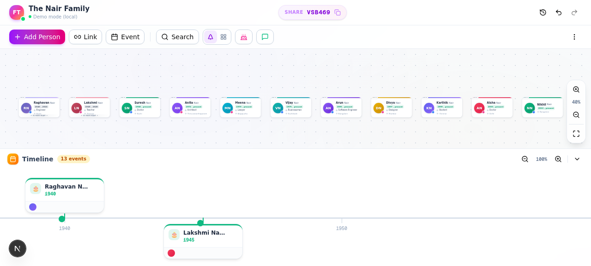
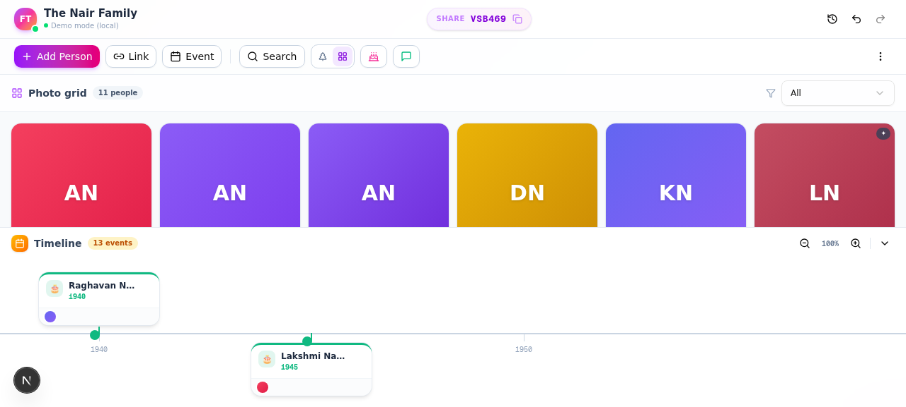
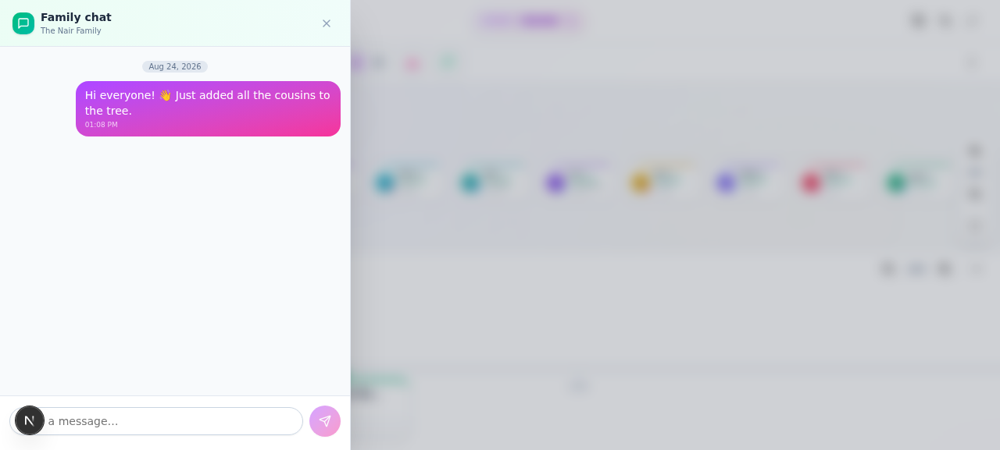
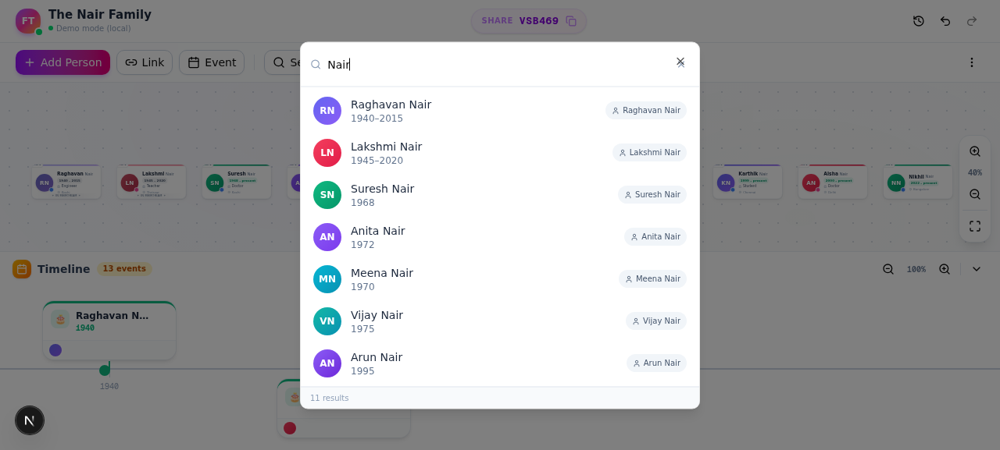
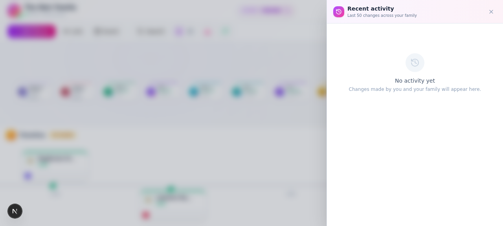
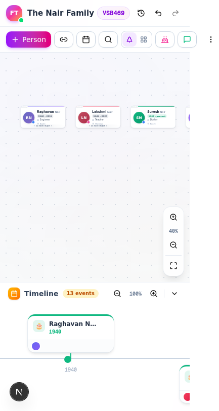

<div align="center">

# 🌳 Family Tree

### Build, visualize, and share your family's story

A modern, collaborative family tree builder with photos, timeline events, real-time chat, audit trail, and PWA install. Built for families to document their heritage together.

[](https://nextjs.org/)
[](https://www.typescriptlang.org/)
[](https://tailwindcss.com/)
[](https://supabase.com/)
[](https://web.dev/progressive-web-apps/)
[](LICENSE)

[Features](#-features) · [Live Demo](#-live-demo) · [Quick Start](#-quick-start) · [Deploy](#-deploy-to-vercel) · [Screenshots](#-screenshots)

</div>

---

## ✨ Features

### Core
- **🌳 Visual family tree** — Auto-layout algorithm places persons across generations with marriage lines and parent-child connections
- **👤 Rich person profiles** — Photo (auto-compressed to WebP), birth/death years, occupation, birthplace, gender, custom avatar colors
- **❤️ Relationships** — Link spouses with marriage year, parent → child, with contradiction validation (marriage year ≤ death year, parent age ≥ 12 at child birth, etc.)
- **📅 Timeline events** — Birth/death/marriage auto-events plus manual milestones (graduation, job, travel) with photos and related persons

### Collaboration
- **🔐 Auth** — Email/password or Google OAuth via Supabase
- **👥 Roles** — Admin / Owner / Editor with granular permissions
- **📋 Activity log** — Every edit tracked with before/after snapshots, revert with one click
- **📜 Per-person history** — Restore any past version of a person
- **💬 Family chat** — Real-time group chat with message persistence
- **🛡️ Multi-family federation** — Link related families (e.g., spouse's tree)

### Power Tools
- **🔍 Search** — Ctrl/Cmd+K palette to find persons by name, place, or occupation
- **📊 Photo grid view** — Alternative masonry layout for browsing on mobile
- **🎂 Birthday reminders** — Surface upcoming birthdays in the next 30 days
- **🏷️ Generation labels** — "Gen 1/2/3" badges on each card for instant hierarchy context
- **📥 CSV import** — Bulk-add persons from a spreadsheet
- **↩️ Undo/redo** — Full history with keyboard shortcuts (Ctrl/Cmd+Z, Shift+Z)
- **📤 Export** — PNG and PDF with high-resolution capture

### Platform
- **📱 PWA installable** — Add to home screen on Android/iOS, works offline
- **📱 Mobile/touch** — Pan, pinch-zoom, touch-friendly UI
- **⚡ Real-time** — Changes sync across all connected family members instantly
- **🎨 Polished UI** — Glassmorphism, gradient accents, dot-grid canvas, smooth animations

---

## 🎬 Live Demo

**Try it now:** [Family Tree Demo](https://preview-chat-0af61295-d4ba-4817-a5aa-dab7f52a34bf.space-z.ai/)

> **Note:** The demo runs in "demo mode" (no Supabase configured) — auth and data are stored locally in your browser. All features work; just sign up with any email/password to explore. For real multi-user collaboration, deploy with Supabase (see [Deploy](#-deploy-to-vercel)).

---

## 🚀 Quick Start

### Prerequisites

- **Node.js 18+** or **Bun**
- A [Supabase](https://supabase.com) account (free tier works) — optional; app runs in demo mode without it

### 1. Clone and install

```bash
git clone https://github.com/yadhukrishnanav/family-tree.git
cd family-tree
bun install   # or: npm install
```

### 2. (Optional) Configure Supabase

1. Create a free project at [supabase.com](https://supabase.com)
2. In the SQL Editor, paste the contents of [`supabase/schema.sql`](supabase/schema.sql) and run it
3. Copy `.env.example` to `.env.local` and fill in:

```env
NEXT_PUBLIC_SUPABASE_URL=https://your-project.supabase.co
NEXT_PUBLIC_SUPABASE_ANON_KEY=your-anon-key
```

4. (Optional) Enable Google OAuth: Supabase Dashboard → Authentication → Providers → Google

### 3. Run

```bash
bun run dev   # or: npm run dev
```

Open [http://localhost:3000](http://localhost:3000).

---

## 📸 Screenshots

### Family tree canvas


### Photo grid view


### Family chat


### Search palette (Ctrl/Cmd+K)


### Recent activity panel


### Mobile responsive


---

## 🛠️ Tech Stack

| Layer | Technology | Why |
|-------|-----------|-----|
| **Framework** | Next.js 16 (App Router) | Server components, fast refresh, Vercel-native |
| **Language** | TypeScript 5 | Type safety end-to-end |
| **Styling** | Tailwind CSS 4 + shadcn/ui | Modern, consistent, accessible components |
| **Backend** | Supabase | Auth + Postgres + Storage + Realtime, generous free tier |
| **State** | React Context + useReducer | Lightweight, no extra deps |
| **Export** | html2canvas + jsPDF | Client-side PNG/PDF generation |
| **PWA** | manifest.json + service worker | Installable, offline-capable |

---

## 📁 Project Structure

```
family-tree/
├── src/
│   ├── app/
│   │   ├── layout.tsx              # PWA manifest, SW registration, toaster
│   │   ├── page.tsx                # Auth gate → FamilyTree workspace
│   │   └── globals.css
│   ├── features/family-tree/
│   │   ├── types.ts                # TypeScript interfaces
│   │   ├── supabase.ts             # Supabase client + photo compression
│   │   ├── auth.tsx                # AuthProvider (email + Google OAuth)
│   │   ├── store.tsx               # StoreProvider (reducer + sync + undo/redo + activity log)
│   │   ├── reducer.ts              # Pure state reducer
│   │   ├── sync.ts                 # Supabase sync + realtime
│   │   ├── activity.ts             # Audit log helpers
│   │   ├── chat.ts                 # Chat helpers
│   │   ├── members.ts              # Member management helpers
│   │   ├── layout.ts               # Auto-layout algorithm
│   │   ├── data.ts                 # Sample data + avatar palettes
│   │   ├── export.ts               # PNG/PDF export
│   │   └── components/             # 17 UI components
│   ├── components/ui/              # shadcn/ui components
│   └── lib/
├── public/
│   ├── manifest.json               # PWA manifest
│   ├── sw.js                       # Service worker
│   └── icon-*.png                  # PWA icons (192/512/maskable)
├── supabase/
│   └── schema.sql                  # Full DB schema: tables, RLS, triggers, storage, realtime
├── .env.example
└── README.md
```

---

## 🗃️ Database Schema

The app uses 6 Supabase tables (all defined in [`supabase/schema.sql`](supabase/schema.sql)):

| Table | Purpose | RLS |
|-------|---------|-----|
| `families` | Top-level family groups (name + share code) | Family members only |
| `family_members` | User ↔ family junction with role | Family members only |
| `persons` | Individual people in trees | Family members only |
| `family_units` | Couples + their children | Family members only |
| `timeline_events` | Birth/death/marriage/manual events | Family members only |
| `activity_log` | Audit trail of all changes | Family members read; admin delete |
| `chat_messages` | In-app family chat | Family members; own-delete or admin |
| `family_links` | Multi-family federation links | Family members read; admin write |

All tables have **Row Level Security** enabled. A `is_family_member(fam_id)` SQL function gates every query.

---

## 🔐 Roles & Permissions

| Role | Can edit | Can delete | Can manage members | Can revert others' edits |
|------|---------|-----------|-------------------|-------------------------|
| **Editor** | ✓ | own only | ✗ | own only |
| **Owner** | ✓ | ✓ | ✓ | ✓ |
| **Admin** | ✓ | ✓ | ✓ | ✓ |

Family creators are auto-assigned the `admin` role via a database trigger.

---

## 📦 Deploy to Vercel

1. **Push to GitHub** (see [Quick Start](#-quick-start))
2. Go to [vercel.com/new](https://vercel.com/new) → import your repo
3. Add environment variables:
   - `NEXT_PUBLIC_SUPABASE_URL`
   - `NEXT_PUBLIC_SUPABASE_ANON_KEY`
4. Deploy — Vercel auto-detects Next.js
5. In Supabase → Authentication → URL Configuration → add your Vercel URL to redirect URLs
6. Visit your live site 🎉

### Custom domain (optional)

- **Free subdomain:** `yourfamily.vercel.app` (comes with Vercel)
- **Free developer domain:** `yourname.is-a.dev` (PR-based, 24-48h approval)
- **Cheap real domain:** `yourfamily.com` from Cloudflare (~$10/year)

---

## 📱 PWA Installation

The app is a Progressive Web App — installable on phones and desktops:

### Android (Chrome)
1. Visit the deployed URL
2. Tap the "Install app" button in the toolbar, OR menu → "Install app"
3. Confirm — app appears on home screen with its own icon

### iOS (Safari)
1. Visit the deployed URL
2. Tap the Share button → "Add to Home Screen"
3. App installs with its own icon, opens fullscreen

### Desktop (Chrome/Edge)
1. Visit the deployed URL
2. Click the install icon in the address bar
3. App opens in its own window

---

## 🤝 Contributing

Contributions are welcome! This is a personal/family project, but if you spot a bug or want to add a feature:

1. Fork the repo
2. Create a branch: `git checkout -b feature/your-feature`
3. Commit: `git commit -m 'Add your-feature'`
4. Push: `git push origin feature/your-feature`
5. Open a Pull Request

### Development

```bash
bun run dev      # Start dev server on localhost:3000
bun run lint     # Run ESLint
bun run build    # Production build
```

---

## 🗺️ Roadmap

- [ ] Full birth date (month/day) support for accurate birthday reminders
- [ ] GEDCOM import/export for serious genealogists
- [ ] Capacitor Android packaging for Play Store distribution
- [ ] Edit locking ("X is editing…") to prevent overwrite races
- [ ] Voice notes per person (let grandparents record stories)
- [ ] Family tree merging wizard

See the [open issues](https://github.com/yadhukrishnanav/family-tree/issues) for ideas, or open a new one with your suggestion.

---

## 📄 License

[MIT](LICENSE) — free for personal and commercial use.

---

## 🙏 Acknowledgments

- [Next.js](https://nextjs.org/) — React framework
- [Supabase](https://supabase.com/) — Backend-as-a-Service
- [shadcn/ui](https://ui.shadcn.com/) — Beautiful, accessible component library
- [Tailwind CSS](https://tailwindcss.com/) — Utility-first CSS
- [Lucide](https://lucide.dev/) — Icon library
- [html2canvas](https://html2canvas.hertzen.com/) + [jsPDF](https://parall.ax/products/jspdf) — Export

---

<div align="center">

**Built with ❤️ for families to preserve their stories**

[⬆ Back to top](#-family-tree)

</div>
